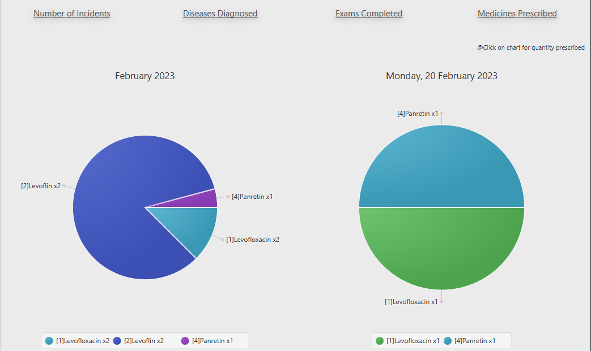

    

<h2 align="center">TEP Medical Database</h2>

<!-- TABLE OF CONTENTS -->

  
Table of Contents

  <ol>
    <li>
      <a href="#about-the-project">About The Project</a>
      <ul>
        <li><a href="#built-with">Built With</a></li>
      </ul>
    </li>
    <li><a href="#details">Details</a></li>
    <li><a href="#how-to-run">How to run</a></li>
    <li><a href="#images">Images</a>
    </li>
</ol>

<!-- ABOUT THE PROJECT -->

## About The Project

TEP is a desktop application made to help organise and manage basic data of a medical institute or hospital.
Made for admins, they can manage staff info, patients info, exams done, employee shifts, medicine given and more. 
They can also see statistics of the database. The application has five major segments Schedule, Patients, Staff, 
Examinations and Database Statistics which will be shown in more detail below. 

(<a href="#top">back to top</a>)

### Built With

* [JDK-15](https://www.oracle.com/java/technologies/downloads/)
* [JavaFx](https://openjfx.io/)
* [SceneBuilder](https://gluonhq.com/products/scene-builder/)
* [MySQL](https://www.mysql.com/)

(<a href="#top">back to top</a>)

## Details

The project is a maven structured javafx application connected with a mySQL database. Database's ER model and Attribute 
Connections can be seen in the pdf files.

(<a href="#top">back to top</a>)

## How to run

* open XAMPP control panel and start Apache, mySQL and Tomcat
* download and put javafx library one directory out of TEP
* open TEP with any IDE (pref. IntelliJ)
* run src/HY360/Main.java

(<a href="#top">back to top</a>)

## Images

### Login

The first thing you'll see is the login screen that has 3 fields, your database name, the database's username
and password (default for mysql if you haven't set it up is username="root" and password=""). By pressing `Create Tables`
you generate all needed database tables. To test the database you can press the `Insert Values` button that fills
the tables with some random data.

### Schedule

In this section you can manage employee shifts. The employees are referenced using their ID which can
be seen at the top table first column.

(<a href="#top">back to top</a>)

### Patients

Here you can see and update patient information, the patients are referenced with their AMKA.

and also find the best doctor for each disease symptom,
sending patients to the correct doctors.

(<a href="#top">back to top</a>)

### Staff 
#### Search Employee

#### Show All Staff

(<a href="#top">back to top</a>)

### Examinations 
#### Diseases

#### Medicines

#### Procedures

#### Doctor Exam Form

(<a href="#top">back to top</a>)

### Database Statistics
#### Status of Visits Today

#### Per Date Statistics
##### Number of Incidents

##### Diseases Diagnosed

##### Exams Completed

(<a href="#top">back to top</a>)

##### Medicines Prescribed

#### Execute direct SQL Queries to the database 

(<a href="#top">back to top</a>)

